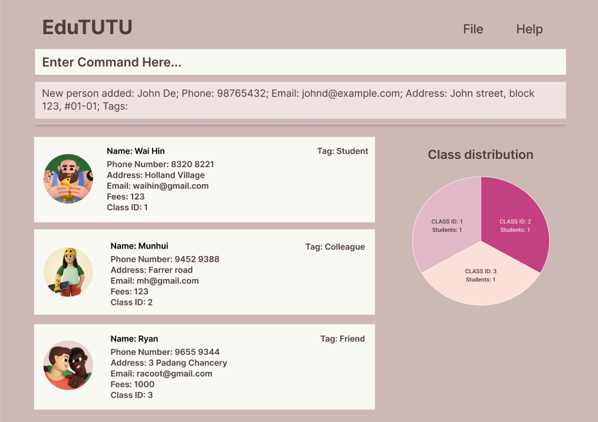
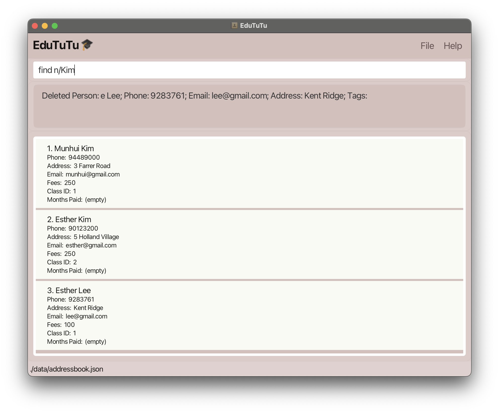
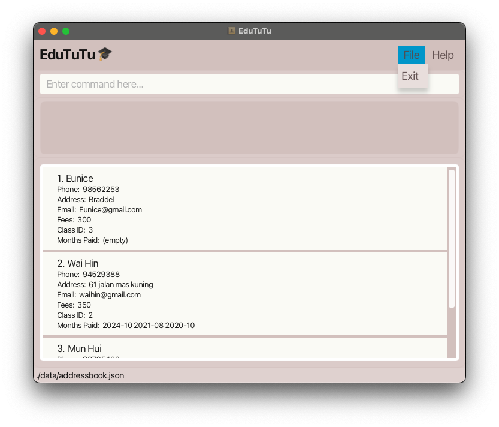

# EduTUTU User Guide

**EduTUTU** is a desktop application designed to streamline contact management for tuition centers, making it easier to 
organise and access student information. Optimised for use through a Command Line Interface (CLI) while incorporating 
the convenience of a Graphical User Interface (GUI), EduTUTU allows you to manage student details with speed and 
efficiency. Whether you’re handling student registrations, updating records, or searching for students, EduTUTU helps 
you complete these tasks more quickly than traditional applications, making it an ideal solution for tuition center 
administrators.
---
## Table of Contents

1. [Installation](#1-installation)
2. [Main Features](#2-main-features)
    - [2.1 Viewing Help](#21-viewing-help)
    - [2.2 Adding a Person](#22-adding-a-person)
    - [2.3 Listing All Persons](#23-listing-all-persons)
    - [2.4 Editing a Person](#24-editing-a-person)
    - [2.5 Locating Persons by Name](#25-locating-persons-by-name)
    - [2.6 Deleting a Person](#26-deleting-a-person)
    - [2.7 Clearing All Entries](#27-clearing-all-entries)
    - [2.8 Exiting the Program](#28-exiting-the-program)
    - [2.9 Saving the Data](#29-saving-the-data)
    - [2.10 Editing the Data File](#210-editing-the-data-file)
3. [FAQs](#3-faqs)

---

## 1. Installation

1. Ensure you have Java `17` or above installed in your Computer.

1. Download the latest `.jar` file from [here](https://github.com/AY2425S1-CS2103T-T15-2/tp/releases/tag/v1.3).

1. Copy the file to the folder you want to use as the _home folder_ for your AddressBook.

1. Open a command terminal, `cd` into the folder you put the jar file in, and use the `java -jar edututu.jar` command to run the application. 
   A GUI similar to the below should appear in a few seconds. Note how the app contains some sample data. 
   

1. Type the command in the command box and press Enter to execute it. e.g. typing **`help`** and pressing Enter will open the help window. 
   Some example commands you can try:

   * `list` : Lists all contacts.

   * `add n/John Doe p/98765432 e/johnd@example.com a/John street, block 123, #01-01` : Adds a contact named `John Doe` to the Address Book.

   * `delete 3` : Deletes the 3rd contact shown in the current list.

   * `clear` : Deletes all contacts.

   * `exit` : Exits the app.

1. Refer to the [Features](#features) below for details of each command.

--------------------------------------------------------------------------------------------------------------------

## 2. Command Instructions

### Command Format Guidelines

* Words in `UPPER_CASE` are the parameters to be supplied by the user. 
  e.g. in `add n/NAME`, `NAME` is a parameter which can be used as `add n/John Doe`.

* Items in square brackets are optional. 
  e.g `n/NAME [t/TAG]` can be used as `n/John Doe t/friend` or as `n/John Doe`.

* Items with `…`​ after them can be used multiple times including zero times. 
  e.g. `[t/TAG]…​` can be used as ` ` (i.e. 0 times), `t/friend`, `t/friend t/family` etc.

* Parameters can be in any order. 
  e.g. if the command specifies `n/NAME p/PHONE_NUMBER`, `p/PHONE_NUMBER n/NAME` is also acceptable.

* Extraneous parameters for commands that do not take in parameters (such as `help`, `list`, `exit` and `clear`) will be ignored. 
  e.g. if the command specifies `help 123`, it will be interpreted as `help`.

* If you are using a PDF version of this document, be careful when copying and pasting commands that span multiple lines as space characters surrounding line-breaks may be omitted when copied over to the application.

---

### 2.1 Viewing Help : `help`

Shows a message explaining how to access the help page.

Format: `help`

---

### 2.2 Adding a Person : `add`

Adds a person to the address book.

Format: `add n/NAME p/PHONE_NUMBER e/EMAIL a/ADDRESS f/FEES c/CLASSID [t/TAG]…​`

> **Tip:** A person can have any number of tags (including 0).

Examples:
* 'add n/John Doe p/98765432 e/johnd@example.com a/John street, block 123, #01-01 f/250 c/1'

---

### 2.3 Listing All Persons : `list`

Shows a list of all persons in the address book.

Format: `list`

---

### 2.4 Editing a Person : `edit`

Edits an existing person in the address book.

Format: `edit INDEX [n/NAME] [p/PHONE] [e/EMAIL] [a/ADDRESS] [f/FEES] [c/CLASSID] [t/TAG]…​`

* Edits the person at the specified `INDEX`. The index refers to the index number shown in the displayed person list. The index **must be a positive integer** 1, 2, 3, …​
* At least one of the optional fields must be provided.
* Existing values will be updated to the input values.
* When editing tags, the existing tags of the person will be removed i.e adding of tags is not cumulative.
* You can remove all the person’s tags by typing `t/` without specifying any tags after it.

Examples:
*  `edit 1 p/91234567 e/johndoe@example.com` Edits the phone number and email address of the 1st person to be `91234567` and `johndoe@example.com` respectively.
*  `edit 2 n/Betsy Crower t/` Edits the name of the 2nd person to be `Betsy Crower` and clears all existing tags.

---

### 2.5 Locating Persons by Name : `find`

Finds persons whose names, class IDs or both contain any of the given keywords.

Format 1: `find n/KEYWORD [MORE_KEYWORDS]`
Format 2: `find c/KEYWORD [MORE_KEYWORDS]`
Format 3: `find n/KEYWORD [MORE_KEYWORDS] c/KEYWORD [MORE_KEYWORDS]`

* The search is case-insensitive. e.g `kim` will match `Kim`
* The order of the keywords does not matter. e.g. `Esther Kim` will match `Kim Esther`
* Only the name is searched.
* Partially matched words will be matched e.g. `Han` will match `Hans`
* Persons matching at least one keyword will be returned (i.e. `OR` search).
  e.g. `Esther Kim` will return `Esther Gruber`, `Kim Yang`
* The priority of the search will be class ID then followed by name.

Examples:

* `find Kim` returns `Munhui Kim` and `Esther Kim`

---

### 2.6 Deleting a Person : `delete`

Deletes the specified person from the address book.

Format: `delete INDEX`

* Deletes the person at the specified `INDEX`.
* The index refers to the index number shown in the displayed person list.
* The index **must be a positive integer** 1, 2, 3, …​

Examples:
* `list` followed by `delete 2` deletes the 2nd person in the address book.
* `find Betsy` followed by `delete 1` deletes the 1st person in the results of the `find` command.

---

### 2.7 Clearing All Entries : `clear`

Clears all entries from the address book.

Command Instructions: `clear`

Upon entering the command, all entries will be cleared from the address book. A message 
"Address book has been cleared!" will be displayed in the command box.

---

### 2.8 Exiting the Program : `exit`

Exits the program.

Exiting the programme can be done by separate ways
Method 1:
1. Clicking the `File` button at the top right corner of the window.
   

2. Next click on the `Exit` button.
3. The program will close.

Method 2:
1. Type the command `exit` in the command box and press Enter.
2. The program will close.

---

### 2.9 Saving the Data

AddressBook data are saved in the hard disk automatically after any command that changes the data. There is no need to save manually.

---

### 2.10 Editing the Data File

AddressBook data are saved automatically as a JSON file `[JAR file location]/data/addressbook.json`. Advanced users are welcome to update data directly by editing that data file.

:exclamation: **Caution:**
If your changes to the data file makes its format invalid, AddressBook will discard all data and start with an empty data file at the next run. Hence, it is recommended to take a backup of the file before editing it. 
Furthermore, certain edits can cause the AddressBook to behave in unexpected ways (e.g., if a value entered is outside of the acceptable range). Therefore, edit the data file only if you are confident that you can update it correctly.

### 2.11 Marking a Payment as Completed

Updates the payment status of a student to completed.

**Format:** `markpaid INDEX YEAR_MONTH`

* Marks the payment of the person at the specified `INDEX` for the given month and year.
* The `INDEX` refers to the index number shown in the displayed person list.
* The `YEAR_MONTH` should be in the format `YYYY-MM` (e.g., `2024-10` for October 2024).
* The index **must be within the range** of the number of people in the list.
* You can only mark the payment as completed for the current or a past month, not for future months.

**Examples:**
* `markpaid 1 2024-10` – Marks the payment of the 1st student as completed for October 2024.
* `markpaid 3 2023-12` – Marks the payment of the 3rd student as completed for December 2023.

### 2.12 Displaying pie chart of class distribution : `piechart`
Creates a pie chart of the distribution of students in each class. Such a feature is meant to give tuition centre 
administrators quick visualisation of the number of students in each class, thus allowing them to efficiently allocate class sizes.

For instance, we have this following data set with 4 students; 1 students in class 1 and 2 students in class 2 and 1 student in class 3.

Upon entering the command pie, a pie chart will be displayed showing the distribution of students in each class.

Format: `pie`

### 2.13 Bar Chart

Displays a bar chart showing the number of students who made payments for each month. This feature allows you to visually track the payment trends.

**Format:** `bar`

* The x-axis representing the months (e.g., 2024-01, 2024-02, etc.).
* The y-axis showing the number of students who made their payments during each month.
* If no payments were made in a given month, the value for that month will be zero.

--------------------------------------------------------------------------------------------------------------------

# 3. FAQ

**Q**: How do I transfer my data to another Computer? 
**A**: Install the app in the other computer and overwrite the empty data file it creates with the file that contains the data of your previous AddressBook home folder.

--------------------------------------------------------------------------------------------------------------------

## Known issues

1. **When using multiple screens**, if you move the application to a secondary screen, and later switch to using only the primary screen, the GUI will open off-screen. The remedy is to delete the `preferences.json` file created by the application before running the application again.
2. **If you minimize the Help Window** and then run the `help` command (or use the `Help` menu, or the keyboard shortcut `F1`) again, the original Help Window will remain minimized, and no new Help Window will appear. The remedy is to manually restore the minimized Help Window.

--------------------------------------------------------------------------------------------------------------------

## Command summary

| Action        | Format, Examples                                                                                                                                                      |
|---------------|-----------------------------------------------------------------------------------------------------------------------------------------------------------------------|
| **Add**       | `add n/NAME p/PHONE_NUMBER e/EMAIL a/ADDRESS [t/TAG]…​`   e.g., `add n/James Ho p/22224444 e/jamesho@example.com a/123, Clementi Rd, 1234665 t/friend t/colleague` |
| **Bar Chart** | `bar`                                                                                                                                                                 |
| **Clear**     | `clear`                                                                                                                                                               |
| **Delete**    | `delete INDEX`  e.g., `delete 3`                                                                                                                                   |
| **Edit**      | `edit INDEX [n/NAME] [p/PHONE_NUMBER] [e/EMAIL] [a/ADDRESS] [t/TAG]…​`  e.g.,`edit 2 n/James Lee e/jameslee@example.com`                                           |
| **Exit**      | `exit`                                                                                                                                                                |
| **Help**      | `help`                                                                                                                                                                |
| **Find**      | `find KEYWORD [MORE_KEYWORDS]`  e.g., `find James Jake`                                                                                                            |
| **List**      | `list`                                                                                                                                                                |
| **Mark Paid** | `mark INDEX`  e.g., `mark 1` (Marks the 1st student's payment as completed)                                                                                        |
| **Pie Chart** | `pie`                                                                                                                                                                 |
