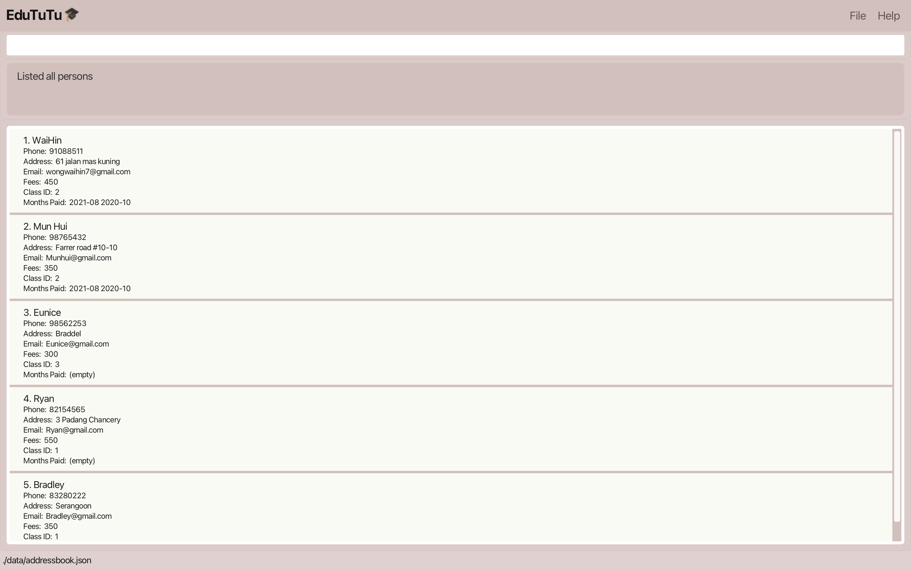
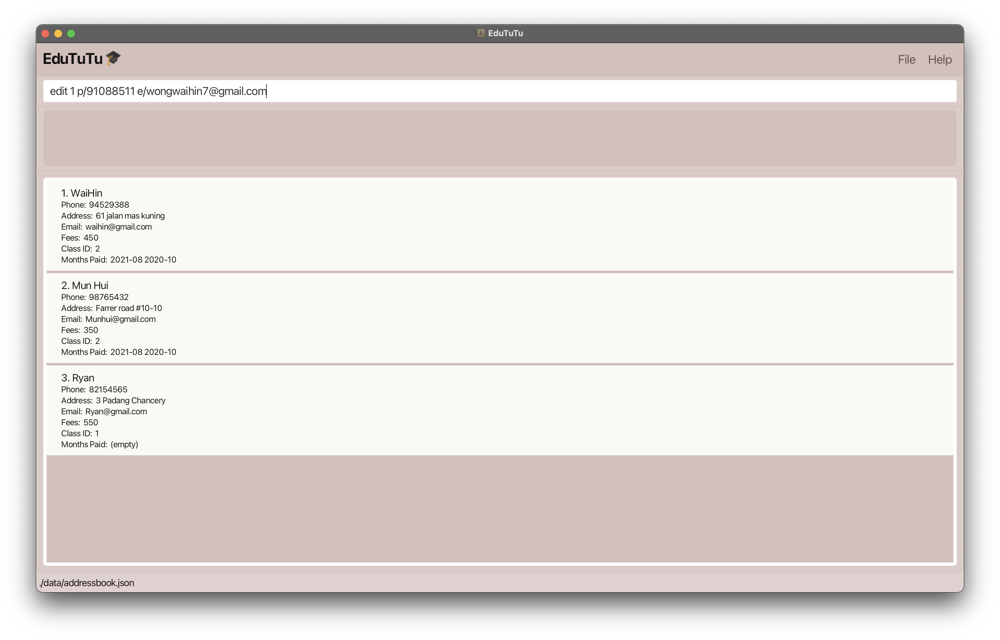
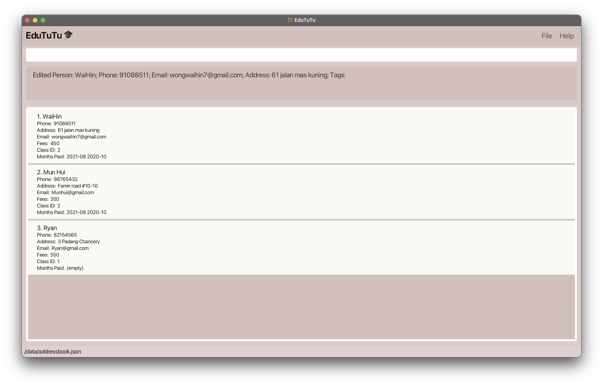
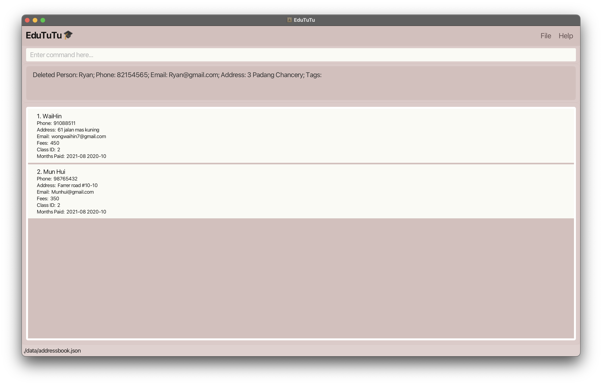
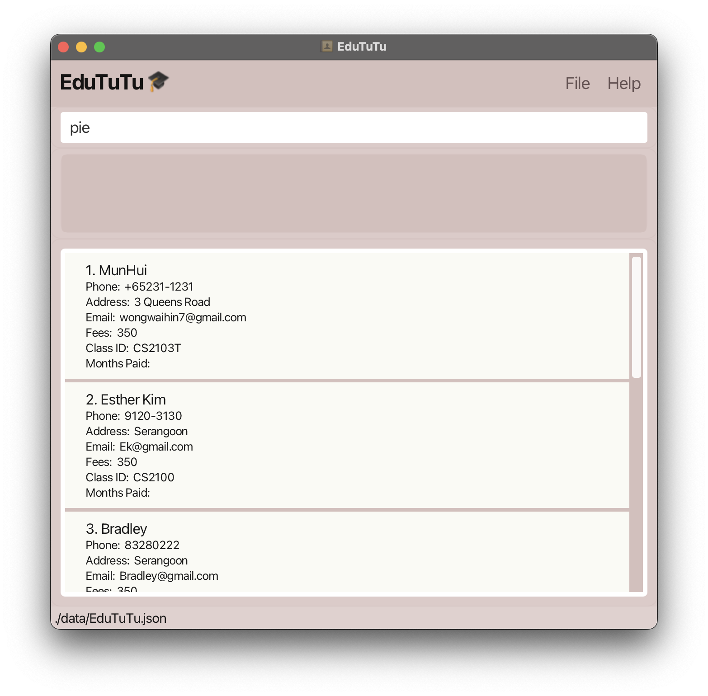
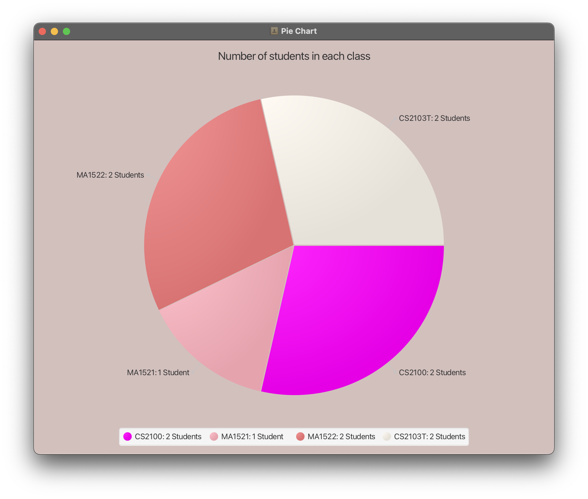
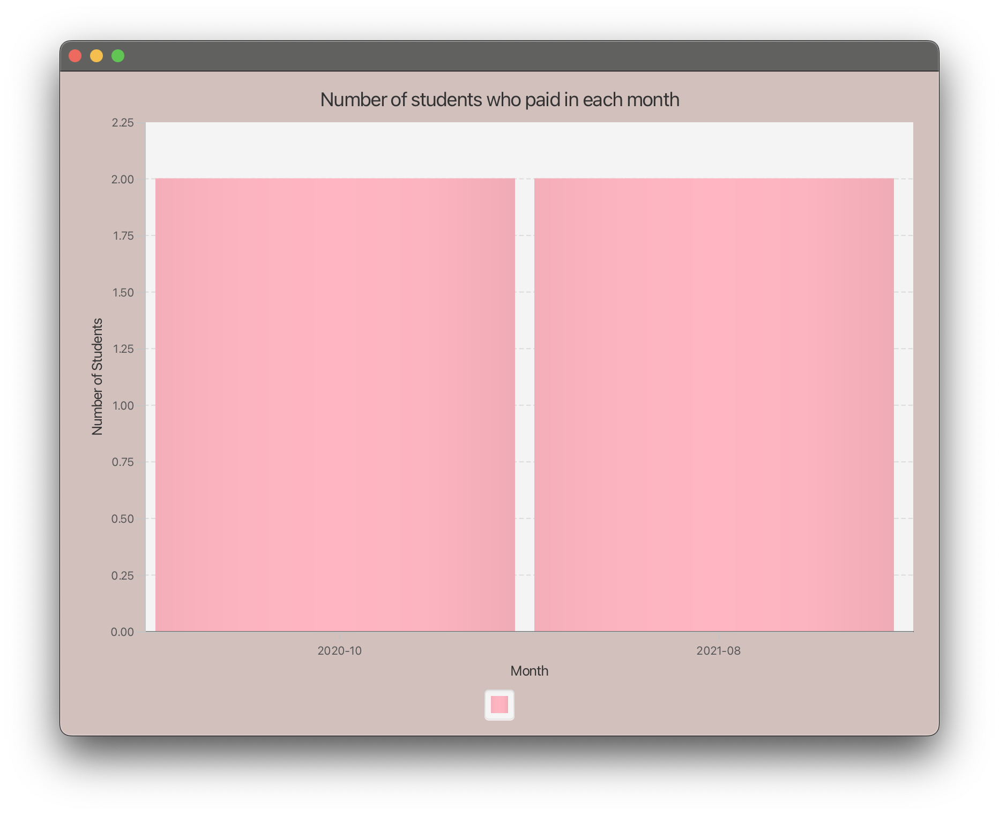

**EduTUTU** is a desktop application designed to streamline contact management for tuition centers, making it easier to 
organise and access student information. Optimised for use through a Command Line Interface (CLI) while incorporating 
the convenience of a Graphical User Interface (GUI), EduTUTU allows you to manage student details with speed and 
efficiency. Whether you’re handling student registrations, updating records, or searching for students, EduTUTU helps 
you complete these tasks more quickly than traditional applications, making it an ideal solution for tuition center 
administrators.

***

## Table of Contents

1. [Installation](#1-installation)
2. [Command Instructions](#2-command-instructions)
   - [2.1 Viewing Help](#21-viewing-help--help)
   - [2.2 Adding a Person](#22-adding-a-person-add)
   - [2.3 Listing All Persons](#23-listing-all-persons-list)
   - [2.4 Editing a Person](#24-editing-a-person-edit)
   - [2.5 Locating Persons by Name](#25-locating-persons-by-name-find)
   - [2.6 Deleting a Person](#26-deleting-a-person-delete)
   - [2.7 Clearing All Entries](#27-clearing-all-entries-clear)
   - [2.8 Exiting the Program](#28-exiting-the-program-exit)
   - [2.9 Saving the Data](#29-saving-the-data)
   - [2.10 Editing the Data File](#210-editing-the-data-file)
   - [2.11 Marking a Payment as Completed](#211-marking-a-payment-as-completed)
   - [2.12 Displaying Pie Chart of Class Distribution](#212-displaying-pie-chart-of-class-distribution-pie)
   - [2.13 Displaying Bar Chart](#213-displaying-bar-chart-bar)
   - [2.14 Viewing Command History](#214-viewing-command-history-arrow-keys)
3. [FAQ](#3-faq)

***

## 1. Installation

1. Ensure you have Java `17` or above installed in your Computer.

1. Download the latest `.jar` file from [here](https://github.com/AY2425S1-CS2103T-T15-2/tp/releases/tag/v1.3).

1. Copy the file to the folder you want to use as the _home folder_ for your AddressBook.

1. Open a command terminal, `cd` into the folder you put the jar file in, and use the `java -jar edututu.jar` command to run the application. 
   A GUI similar to the below should appear in a few seconds. Note how the app contains some sample data. 
   

1. Type the command in the command box and press Enter to execute it. e.g. typing **`help`** and pressing Enter will open the help window. 
   Some example commands you can try:

   * `list` : Lists all contacts.

   * `add n/John Doe p/98765432 e/johnd@example.com a/John street, block 123, #01-01 f/250, c/1 ` : Adds a contact named `John Doe` to the Address Book.

   * `delete 3` : Deletes the 3rd contact shown in the current list.

   * `clear` : Deletes all contacts.

   * `exit` : Exits the app.

1. Refer to the features below for details of each command.

[Back to Table of Contents](#table-of-contents)

***

## 2. Command Instructions

### Command Format Guidelines

* Words in `UPPER_CASE` are the parameters to be supplied by the user. 
  e.g. in `add n/NAME`, `NAME` is a parameter which can be used as `add n/John Doe`.

* Items in square brackets are optional. 
  e.g `n/NAME [t/TAG]` can be used as `n/John Doe t/friend` or as `n/John Doe`.

* Items with `…`​ after them can be used multiple times including zero times. 
  e.g. `[t/TAG]…​` can be used as ` ` (i.e. 0 times), `t/friend`, `t/friend t/family` etc.

* Parameters can be in any order. 
  e.g. if the command specifies `n/NAME p/PHONE_NUMBER`, `p/PHONE_NUMBER n/NAME` is also acceptable.

* Extraneous parameters for commands that do not take in parameters (such as `help`, `list`, `exit` and `clear`) will be ignored. 
  e.g. if the command specifies `help 123`, it will be interpreted as `help`.

* If you are using a PDF version of this document, be careful when copying and pasting commands that span multiple lines as space characters surrounding line-breaks may be omitted when copied over to the application.

[Back to Table of Contents](#table-of-contents)

***

### 2.1 Viewing Help : `help`

Command Format: `help`

Shows a message explaining how to access the help page.

[Back to Table of Contents](#table-of-contents)

***

### 2.2 Adding a Person: `add`

Adds a person to Edututu.

**Command Format:** `add n/NAME p/PHONE_NUMBER e/EMAIL a/ADDRESS f/FEES c/CLASSID [t/TAG]…​`

> **Remark:** A person can have any number of tags (including 0).

**Example Usage:**

`add n/Ryan p/82154565 e/Ryan@gmail.com a/3 Padang Chancery f/550 c/1`

*Input: User enters the `add` command.*  

*Output: The UI updates to show the added person.*  

**Tips:**

- Use the `add` command to add a new person with their name, phone number, email, address, fees, and class ID.
- Tags can be added to classify or group persons for easier management.
- The `add` command is helpful when setting up new contacts in EduTuTu.

[Back to Table of Contents](#table-of-contents)

***

### 2.3 Listing All Persons: `list`

The `list` command displays a list of all persons currently stored in EduTuTu.

**Command Format:** `list`

After entering the `list` command, all persons stored in the address book will be displayed in the UI.

**Example Usage:**

*Input: User enters the `list` command.*

*Output: The UI updates to show all persons.*
  

**Tips:**

- Use the `list` command whenever you want to view all entries in your address book.
- The `list` command is particularly useful after adding, editing, or deleting records to confirm changes.

[Back to Table of Contents](#table-of-contents)

***

### 2.4 Editing a Person: `edit`

Edits an existing person in the address book.

**Command Format:** `edit INDEX [n/NAME] [p/PHONE] [e/EMAIL] [a/ADDRESS] [f/FEES] [c/CLASSID] [t/TAG]…​`

* Edits the person at the specified `INDEX`. The index refers to the index number shown in the displayed person list. The index **must be a positive integer** 1, 2, 3, …​
* At least one of the optional fields must be provided.
* Existing values will be updated to the input values.
* When editing tags, the existing tags of the person will be removed, i.e., adding of tags is not cumulative.
* You can remove all the person’s tags by typing `t/` without specifying any tags after it.

**Example Usage:**

`edit 1 p/91088511 e/wongwaihin7@gmail.com`  

*Input: User enters the `edit` command to change the phone number and email address of the 1st person.*  

*Output: The UI updates to show the edited details.*  

**Tips:**

- Use the `edit` command to update a person’s details when changes occur.
- Make sure to use the correct `INDEX` as shown in the displayed list to edit the right person.
- The `edit` command is particularly useful for keeping contact information up to date.

[Back to Table of Contents](#table-of-contents)

***

### 2.5 Locating Persons by Name: `find`

Finds persons whose names, class IDs, or both contain any of the given keywords.

**Command Format:**
- Format 1: `find n/KEYWORD [MORE_KEYWORDS]`
- Format 2: `find c/KEYWORD [MORE_KEYWORDS]`
- Format 3: `find n/KEYWORD [MORE_KEYWORDS] c/KEYWORD2 [MORE_KEYWORDS2]`

* The search is case-insensitive. e.g., `kim` will match `Kim`.
* The order of the keywords does not matter. e.g., `Esther Kim` will match `Kim Esther`.
* Only the name is searched when using `n/` format.
* Partially matched words will be matched, e.g., `Han` will match `Hans`.
* find `n/KEYWORD c/KEYWORD2` will match persons with names containing `KEYWORD` and class IDs containing `KEYWORD2`.

**Example Usage:**

`find n/Kim`  

*Input: User enters the `find` command to search for persons whose names contain the keyword `Kim`.*  

*Output: The UI updates to show persons matching the search keyword.*  

**Tips:**

- Use the `find` command to quickly locate persons based on their names or class IDs.
- The `find` command is particularly useful when you have a large list and need to filter by specific attributes.

[Back to Table of Contents](#table-of-contents)

***

### 2.6 Deleting a Person: `delete`

Deletes the specified person from the address book.

**Command Format:** `delete INDEX`

* Deletes the person at the specified `INDEX`.
* The index refers to the index number shown in the displayed person list.
* The index **must be a positive integer** 1, 2, 3, …​

**Example Usage:**

`delete 3`  

*Input: User enters the `delete 3` command to remove the 3rd person in the displayed list.*  

*Output: The UI updates to reflect the deletion of the person.*  

**Tips:**

- Use the `delete` command to remove outdated or incorrect entries from the address book.
- Make sure to confirm the index number before deleting to avoid removing the wrong person.
- The `delete` command is especially useful when cleaning up your list of contacts.

[Back to Table of Contents](#table-of-contents)

***

### 2.7 Clearing All Entries: `clear`

Clears all entries from the address book.

**Command Format:** `clear`

Upon entering the command, all entries will be cleared from Edututu. A message  
"Address book has been cleared!" will be displayed in the command box.

**Example Usage:**

`clear`  

*Input: User enters the `clear` command to remove all entries.*  

*Output: The UI updates to show that all entries have been cleared.*

**Tips:**

- Use the `clear` command when you want to start fresh with an empty address book.
- Be careful when using this command, as it permanently deletes all current entries.
- Consider exporting your data before using the `clear` command if you need a backup.

[Back to Table of Contents](#table-of-contents)

***

### 2.8 Exiting the Program: `exit`

**Command Format:** `exit`

Exits the program.

Exiting the program can be done in two ways:

**Method 1:**
1. Click the `File` button at the top right corner of the window.  
   
2. Click on the `Exit` button.
3. The program will close.

**Method 2:**
1. Type the command `exit` in the command box and press Enter.
   

2. The program will close.

**Tips:**

- Use the `exit` command when you want to close the program quickly through the command box.
- Both methods achieve the same result, so use whichever is more convenient.

[Back to Table of Contents](#table-of-contents)

***

### 2.9 Saving the Data

EduTuTu data are saved in the hard disk automatically after any command that changes the data. There is no need to save manually.

[Back to Table of Contents](#table-of-contents)

***

### 2.10 Editing the Data File

EduTuTu data is saved automatically as a JSON file at `[JAR file location]/data/addressbook.json`. Advanced users can update data directly by editing this data file.

> **Caution:**
> - If your changes to the data file make its format invalid, EduTuTu will discard all data and start with an empty data file at the next run. It is highly recommended to take a backup of the file before making any edits.
> - Certain edits can cause EduTuTu to behave unexpectedly (e.g., if a value entered is outside the acceptable range). Edit the data file only if you are confident in your ability to update it correctly.

[Back to Table of Contents](#table-of-contents)

***

### 2.11 Marking a Payment as Completed: `markpaid`

Updates the payment status of a student to completed.

**Format:** `markpaid INDEX m/YEAR_MONTH`

* Marks the payment of the person at the specified `INDEX` for the given month and year.
* The `INDEX` refers to the index number shown in the displayed person list.
* The `YEAR_MONTH` should be in the format `YYYY-MM` (e.g., `2024-10` for October 2024).
* The index **must be within the range** of the number of people in the list.
* The year must be within the range of 1900 to 2100, and the month must be within the valid 1-12 range.

**Example Usage:**
*Input: User enters the `markpaid 1 /m 2024-10` mark the first student as paid for October 2024.*
  

*Output: The UI updates to show the payment status of the student.*
  

[Back to Table of Contents](#table-of-contents)

***

### 2.12 Displaying Pie Chart of Class Distribution: `pie`

Creates a pie chart showing the distribution of students in each class. This feature allows tuition center administrators to quickly visualize the number of students in each class, helping them efficiently allocate class sizes.

**Command Format:** `pie`

For example, given the following data set with 4 students:
- 1 student in class 1
- 2 students in class 2
- 1 student in class 3

*Input: User enters the `pie` command.*  

*Output: A pie chart is displayed, showing the distribution of students in each class.*  

**Tips:**

- Use the `pie` command to get a quick overview of class sizes, which is particularly useful for planning and class allocation.
- Make sure the data is up-to-date before using the `pie` command for accurate visualization.

[Back to Table of Contents](#table-of-contents)

***

### 2.13 Displaying Bar Chart: `bar`

Displays a bar chart showing the number of students who made payments for each month. This feature allows you to visually track payment trends over time.

**Command Format:** `bar`

* The x-axis represents the months (e.g., 2024-01, 2024-02, etc.).
* The y-axis shows the number of students who made their payments during each month.
* If no payments were made in a given month, the value for that month will be zero.

*Input: User enters the `bar` command.*  

*Output: A bar chart is displayed, showing the number of students who made payments for each month.*

**Tips:**

- Use the `bar` command to monitor payment trends and identify any seasonal patterns.
- This feature can help tuition center administrators manage cash flow and forecast future payment periods.
- Ensure that all payment records are updated for accurate chart visualization.

[Back to Table of Contents](#table-of-contents)

***

### 2.14 Viewing Command History: `Arrow Keys`

Allows users to quickly access previously entered commands using the up and down arrow keys.

**Command Format:** *No specific command required.*

* Press the **up arrow key** to cycle back through previously entered commands.
* Press the **down arrow key** to move forward through the command history.
* This feature is useful for repeating recent commands without needing to retype them.

**Tips:**

- Use the arrow keys to quickly correct or modify a recent command.
- This feature can save time when you need to execute similar commands repeatedly.

[Back to Table of Contents](#table-of-contents)

***

# 3. FAQ

**Q**: How do I transfer my data to another Computer? 
**A**: Install the app in the other computer and overwrite the empty data file it creates with the file that contains the data of your previous AddressBook home folder.

[Back to Table of Contents](#table-of-contents)

***

## Known issues

1. **When using multiple screens**, if you move the application to a secondary screen, and later switch to using only the primary screen, the GUI will open off-screen. The remedy is to delete the `preferences.json` file created by the application before running the application again.
2. **If you minimize the Help Window** and then run the `help` command (or use the `Help` menu, or the keyboard shortcut `F1`) again, the original Help Window will remain minimized, and no new Help Window will appear. The remedy is to manually restore the minimized Help Window.

[Back to Table of Contents](#table-of-contents)

***

## Command summary

| Action        | Format, Examples                                                                                                                                                      |
|---------------|-----------------------------------------------------------------------------------------------------------------------------------------------------------------------|
| **Add**       | `add n/NAME p/PHONE_NUMBER e/EMAIL a/ADDRESS [t/TAG]…​`   e.g., `add n/James Ho p/22224444 e/jamesho@example.com a/123, Clementi Rd, 1234665 t/friend t/colleague` |
| **Bar Chart** | `bar`                                                                                                                                                                 |
| **Clear**     | `clear`                                                                                                                                                               |
| **Delete**    | `delete INDEX`  e.g., `delete 3`                                                                                                                                   |
| **Edit**      | `edit INDEX [n/NAME] [p/PHONE_NUMBER] [e/EMAIL] [a/ADDRESS] [t/TAG]…​`  e.g.,`edit 2 n/James Lee e/jameslee@example.com`                                           |
| **Exit**      | `exit`                                                                                                                                                                |
| **Help**      | `help`                                                                                                                                                                |
| **Find**      | `find KEYWORD [MORE_KEYWORDS]`  e.g., `find James Jake`                                                                                                            |
| **List**      | `list`                                                                                                                                                                |
| **Mark Paid** | `mark INDEX`  e.g., `mark 1` (Marks the 1st student's payment as completed)                                                                                        |
| **Pie Chart** | `pie`                                                                                                                                                                 |

[Back to Table of Contents](#table-of-contents)
